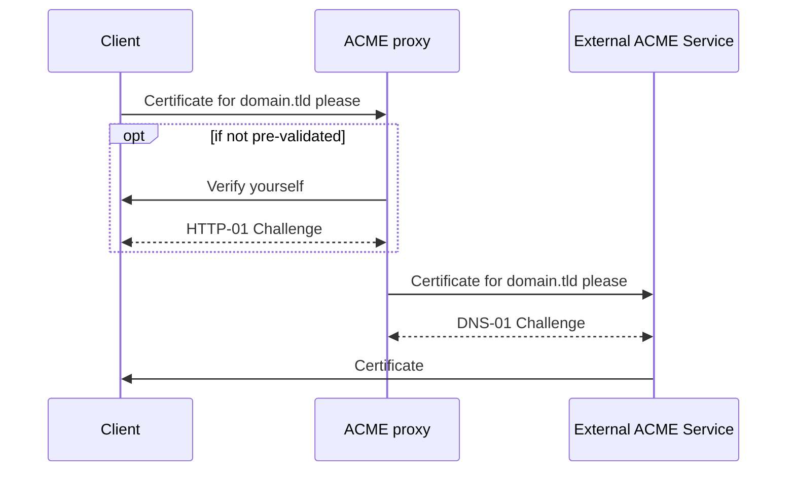

I like TLS, and I cannot lie.

How I implemented a proxy for ACME challenges to make local certificates frictionless.


## The problem

My biggest gripe with how I manage certificate requests today is credential management. I am not particularly fond of the idea of putting access keys to edit DNS records all over.

I am slowly rebuilding my homeserver and home-lab. The very same homeserver mentioned in the last post (spoiler, it did not get finished in 2025). As part of this, I have taken a new approach to planning and executing this rebuild. It consists of deep-dives into solutions that may or may not see the light of day. One of these deep-dives has been certificate handling, specifically certificates for the browser, or just other implementations that does ACME.

I don't plan to put these things on the internet, so there is no need to have a single reverse proxy to rule my LAN. However, a reverse proxy per box(or appliance) makes much more sense, it allows for better access while doing maintenance, segmentation further down in the OSI model, it also makes it easier to trace services back to the box it resides on.

The ways of my reverse proxy management is outdated, it's from before we had discovery-based configuration like Traefik and even before `TLS-SNI-01` got deprecated. This setup was built around the need for a external port 80 exposed for `HTTP-01` challenges. `DNS-01` has since been retrofitted into this setup, but the topology has stayed the same, even after the deployment of a local DNS server for split-dns availability.

## The search

I was looking for a few key functionalities:

- The ability to get certificates from Let's Encrypt, or any other public ACME server.
- The least amount of friction to integrate with the clients.

I had a mental note for [Cert Warden](https://www.certwarden.com) after reading reddit, so it was the first thing I checked out. It looked very promising, it solves the credential spew by being a central place to issue ACME challenges, rather than storing the credentials for DNS automation on every host. It unfortunately fell short on the integration, as it exposes the generated certificates over its own REST schema instead of any established standard.

The trip down Cert Warden lane made me realize that the path of least resistance is a piece of software that speaks ACME all the way through. What I wanted was actually a ACME proxy server, where only the proxy needed the credentials for the DNS provider, while answering to internal ACME requests.

The first internet searches points me to self-hosting a Certificate Authority for issuing "self-signed" certificates over ACME. That's more than I want to manage, and that's even before considering how to get these certificates trusted on my devices (TLDR; expensive, as you need a MDM setup for iOS). The software for this is great, there's well-established projects like step-ca and CertManager.

Speaking of step-ca, the first project I found builds on top of it, to do exactly what I want. ESnet's [acme-proxy](https://software.es.net/acme-proxy/) works by receiving `HTTP-01` challenges internally, it then validates the local ACME challenge, before then starting a order to the external CA. This looked very promising, I however noted two cons for it, building on another project, and depending on the external CA to support EAB's for issuing (which excludes Let's Encrypt as a option). I did also note step-ca as a pro, as I might have some other use-cases for it later.

Another project that popped up on my path, is also built on another project. [Serles](https://serles-acme.readthedocs.io/en/latest/index.html) extends [EJBCA](https://www.ejbca.org), this also ticked all the boxes, with its certbot backend. Much like acme-proxy, it got a con of depending on another project.

The last project I looked into was [acme2certifier](https://github.com/grindsa/acme2certifier). This project, like the two others ticks my boxes, while being self-contained (more on that later). It can do some of the same internal validation steps that acme-proxy can, along with some DNS validation.

### The find

At a glance, the decision matrix looked like this:

| Project        | Support Let's Encrypt | Easy to integrate | Standalone |
|----------------|-----------------------|-------------------|------------|
| Cert Warden    | yes                   | no                | yes        |
| acme-proxy     | no                    | yes               | no         |
| Serles         | yes                   | yes               | no         |
| acme2certifier | yes                   | yes               | yes        |

Implementing acme2certifier makes the most sense for my current setup, it's relatively lightweight, it's under active development, and the developer seem to know what they're doing.

## Implementation

Acme2certifier lets me implement a certificate request flow that looks like this:



The proxy receives the request. It locally validates the request by using the `HTTP-01` challenge type, if the domain is not pre-validated. Once validated, the proxy starts the `DNS-01` challenge process against the external ACME service in order to generate a certificate, the generated certificate is then sent from the external service to the proxy, which sends it to the client.

To make use of this solution, I only have to configure the client to use the local ACME server, which is a straight forward ordeal in most scenarios.

### Tech-stack

This functionality resides on the same physical box that houses my routing, as I class this as a important service, that depends on the internet to do it's thing. Because I seemingly like pain, routing is today handled by a OpnSense vm on a Proxmox node, this node has some compute and memory left to run a LXC with a couple of vital services. The LXC runs Fedora IoT, which is an image based distro, making upgrades and rollbacks easier. The goal is to run all the services with Podman, managed/bootstrapped with Ansible.

### Container

One of the features I like with Podman, it's quadlets, it is a way to define a container as a SystemD unit. This makes it quite easy to manage the the container like one would manage any other service, it also gives me the ability to use the SystemD Ansible module to manage the container, outside creation.

This project is in active development, it addressed a pull request, as well as a couple of issues of mine while I was implementing this. To keep track of potential config changes I need to make, I use a version tag, and have set up release watching on GitHub to follow development.

```ini {lineNos=false}
[Container]
ContainerName=acme2certifier
Image=ghcr.io/grindsa/acme2certifier:0.44-nginx-django
PublishPort=22280:80
PublishPort=22443:443
Volume=/opt/appdata/rootful/acme2certifier:/var/www/acme2certifier/volume
AutoUpdate=registry
Pull=newer

[Install]
WantedBy=default.target
```

The init of this container depends on writing to directories as root, as learning user remapping in Podman was out-of-scope for this deep-dive, I let this container run as root. I chose the Django variant because it serves the WSGI backend over HTTP, it does so by running supervisord to handle both Gunicorn and Nginx, which is another task that thrives with root.

Additionally, the presence of Nginx in the container, makes it capable of serving the service over HTTPS if it is given certificates. This is beneficial as most ACME clients do not want to interface with unencrypted ACME servers due to the nature of the clients task.

### External ACME challenges

In order for acme2certifier to do external challenges with `DNS-01`, it needs a copy of [acme.sh](https://github.com/acmesh-official/acme.sh). Most likely in order to not reinvent the wheel, and to piggyback of the great work already done with providers.
This is not a dependency that needs setup, it simply just need the files to exist in a path you make it aware of.

My original plan to get these files, was to do a git clone to the volume already set up for the container, but then I remembered the image volume driver in Podman. This allows using a OCI image as a volume for containers, with all the benefits of handling images locally, like tags and pull rules.

I tested this approach for a while, and found it quite feasible. I made a [PR](https://github.com/grindsa/acme2certifier/pull/327) with my findings, so others could also benefit.

To use this in the quadlet I had to amend this line to the container section.

```ini {lineNos=false}
Mount=type=image,source=docker.io/neilpang/acme.sh,target=/var/www/acme2certifier/volume/acmesh,rw=true,subpath=/acmebin
```

This places the content of `/acmebin` from the acme.sh container into the path `/var/www/acme2certifier/volume/acmesh` inside the acme2certifier container.


```ini
[Container]
ContainerName=acme2certifier
Image=ghcr.io/grindsa/acme2certifier:0.44-nginx-django
LogDriver=journald
Mount=type=image,source=docker.io/neilpang/acme.sh,target=/var/www/acme2certifier/volume/acmesh,rw=true,subpath=/acmebin
Network=util-rootful
PublishPort=22280:80
PublishPort=22443:443
Volume=/opt/appdata/rootful/acme2certifier:/var/www/acme2certifier/volume:Z
AutoUpdate=registry
Pull=newer

[Install]
WantedBy=default.target
```


### Local config

This acme2certifier setup is driven by two config files, `setup.py` as I am using the Django variant, and `acme_srv.cfg`.

#### Django

Django needs almost no configuration, I need two changes. Setting the `ALLOWED_HOSTS`, as well as telling it to use SQLite for its database, I do not think I will have any amount of load or parallel load that warrants something else than a filebased database.

```py {lineNos=false}
ALLOWED_HOSTS = ['127.0.0.1', 'lxc-name.domain.tld']
```

```py {lineNos=false}
DATABASES = {
    "default": {
        "ENGINE": "django.db.backends.sqlite3",
        "NAME": "/var/www/acme2certifier/volume/db.sqlite3",
    },
}
```

The initial run will also set the secret key (as I am templating this file with Ansible, I also have to track the secret key).

#### Application

The application config file needs more adjustments, mostly around how it should integrate with acme.sh

I set the DB Handler to use the same database as specified in Django

```ini {lineNos=false}
[DEFAULT]
debug: False

[DBhandler]
dbfile: /var/www/acme2certifier/volume/db.sqlite3
```

##### CA Handler

```ini {lineNos=false}
[CAhandler]
acme_keyfile: /var/www/acme2certifier/volume/acme_srv/le_staging_private_key.json
acme_url: https://acme-staging-v02.api.letsencrypt.org
acme_account_email: my@email.tld

handler_file: /var/www/acme2certifier/examples/ca_handler/acme_ca_handler.py
acme_sh_script: /var/www/acme2certifier/volume/acmesh/acme.sh
acme_sh_shell: /bin/bash

dns_update_script: /var/www/acme2certifier/volume/acmesh/dnsapi/dns_cf.sh
dns_update_script_variables: {"LE_WORKING_DIR": "/var/www/acme2certifier/volume/acmehome", "CF_Token": "", "CF_Account_ID": ""}
```

The acme.sh specific settings are handled by the CAHandler section of the config file.

The first part defines account information for Let's Encrypt. I tell it my email, to use the staging LE server, and where to store the account details LE responds with, for later re-use. Remember the keyfile is server specific, which is why I use le_staging as part of it's name.

The second part tells acme2certifier what internal handler it should use, where it can find acme.sh, and what shell to use. I set it to use the bundled unmodified ACME handler.

The last part specifies the DNS plugin it should use. It needs to be told where to find it, and what environment variables it needs to run acme.sh with. The script_variable variable takes json as input, where the key is the name of the environment variable, and the key is the value. In order for acme.sh to write to a persistent and writeable directory, I had to pass the `LE_WORKING_DIR` variable, as it is run in the same context as the app. This is also where provider variables goes, here I am using Cloudflare.

##### Validation

As mentioned the project has some validation methods for the internal requests, these are also configured in the same file.

```ini {lineNos=false}
[Authorization]
prevalidated_domainlist= ["*.domain.tld", "domain.tld"]
prevalidated_iplist = ["10.0.0.0/27", "10.0.0.200"]
```

As this runs on my LAN, I allow any client that meet the requirement for the relevant type above to skip the internal `HTTP-01` validation, so for domain certificates `prevalidated_domainlist` needs to match, for ip certificates `prevalidated_iplist` needs to match. This does expose the service for potential abuse, but as I currently own all the devices on the network, it's something I am comfortable with.

The project supports custom EAB implementations, which means one could hook this up to an identity provider where one identity could be pre-validated for specific domains. This is something I would consider if I decide on a local machine identity scheme.


```ini
[DEFAULT]
debug: False

[DBhandler]
dbfile: /var/www/acme2certifier/volume/db.sqlite3

[Authorization]
prevalidated_domainlist= ["*.domain.tld", "domain.tld"]
#prevalidated_iplist = ["10.0.0.0/27", "10.0.0.200"]

[CAhandler]
acme_keyfile: /var/www/acme2certifier/volume/acme_srv/le_staging_private_key.json
acme_url: https://acme-staging-v02.api.letsencrypt.org
acme_account_email: my@email.tld

handler_file: /var/www/acme2certifier/examples/ca_handler/acme_ca_handler.py
acme_sh_script: /var/www/acme2certifier/volume/acmesh/acme.sh
acme_sh_shell: /bin/bash

dns_update_script: /var/www/acme2certifier/volume/acmesh/dnsapi/dns_cf.sh
dns_update_script_variables: {"LE_WORKING_DIR": "/var/www/acme2certifier/volume/acmehome", "CF_Token": "", "CF_Account_ID": ""}
dns_validation_timeout: 10
```


## Testing the implementation

As noted in the search section, many ACME clients do not like unencrypted ACME servers. This gives you a couple of ways to test certificate issuance:

- Expose the ACME server over HTTPS.
    - Reverse proxy
    - Give the container a certificate

  Both of these methods depends on obtaining a signed certificate from elsewhere.
- Use a older client that does allow unencrypted ACME servers.
    - Like lego v4.25.1
- Use Certbot

I did my tests with an outdated lego container.

```sh {lineNos=false}
docker run -i -v $PWD/.lego:/.lego/ --rm --name lego -p 80:80 \
  goacme/lego:v4.25.1 -s http://lxc-name.domain.tld:22280 -a --email "my@email.tld" \
  -d test.domain.tld --cert.timeout 180 --http run
```

## Exposing the proxy over HTTPS

To expose the service over HTTPS, I landed on Certbot. This was mostly because the version of lego available in Fedora is outdated.

To configure Certbot, I edited `/etc/letsencrypt/cli.ini`

```ini
server = http://lxc-name.domain.tld:22280

email = my@email.tld
agree-tos = True

authenticator = standalone
http-01-port = 22080

non-interactive = True

deploy-hook = /etc/letsencrypt/renewal-hooks/deploy/deploy_hook.sh

# Existing config from distro
preconfigured-renewal = True
max-log-backups = 0
```

The first thing I set is the ACME server, as Certbot allows for a unencrypted I set it to use the HTTP port.

After telling it what email to use for the ACME account, I set it to standalone authentication. This means it will spin up it's own webserver to host the `HTTP-01` challenge. Because the domain this is generating a certificate for, is in the pre-validated list, the webserver isn't actually queried, therefore I also change the port, to make it easier to potentially run a webserver on the host.

Most of the magic is done trough the deploy-hook. The hook is a script that gets run after Certbot has generated certificates, we can use this to copy the new certificate to the acme2certifier volume, as well as restart the service to make the application pick up the new certificate.

```sh
#!/bin/bash

ACME2CERTIFIER_VOLUME="/opt/appdata/rootful/acme2certifier"

if [[ "$RENEWED_DOMAINS" == *"lxc-name.domain.tld"* ]]; then

  rm "${ACME2CERTIFIER_VOLUME}/acme2certifier_cert.pem"
  rm "${ACME2CERTIFIER_VOLUME}/acme2certifier_key.pem"

  cp "/${RENEWED_LINEAGE}/fullchain.pem" "${ACME2CERTIFIER_VOLUME}/acme2certifier_cert.pem"
  cp "/${RENEWED_LINEAGE}/privkey.pem" "${ACME2CERTIFIER_VOLUME}/acme2certifier_key.pem"

  systemctl restart acme2certifier.service

fi
```

The variables `RENEWED_LINEAGE` and `RENEWED_DOMAINS` are set by Certbot.

## Wrapping up

With this setup I can issue Let's Encrypt certificates without distributing credentials everywhere, which in turn means the barrier for entry to implement HTTPS locally is way lower. There is several pieces of my infrastructure that will benefit from this. The Raspberry PIs that runs PiHole are some early contenders.
